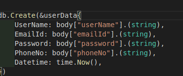
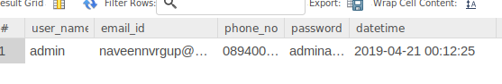
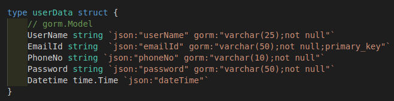
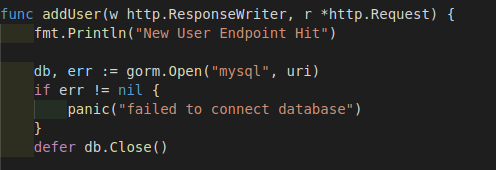
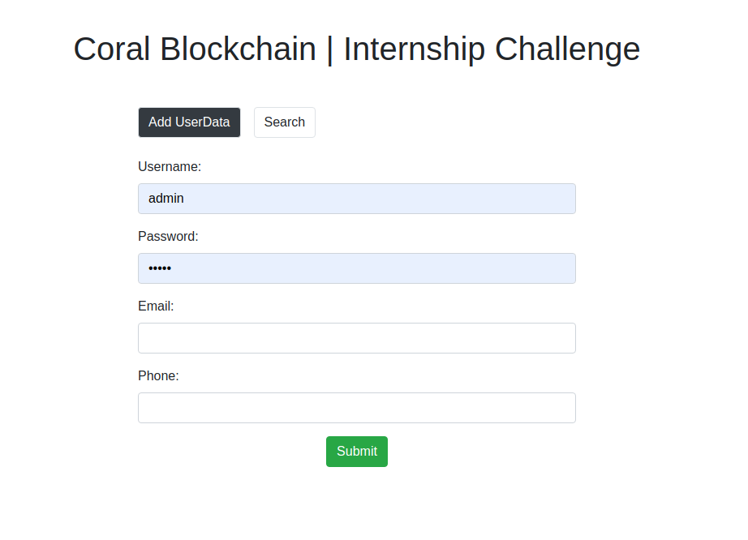
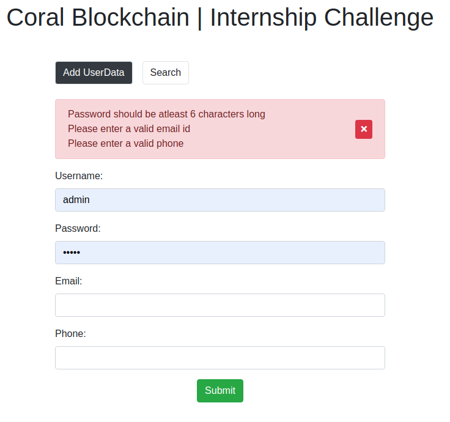
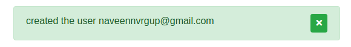
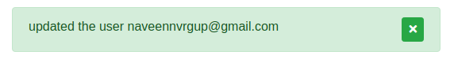

# Coral_Blockchain | Internship Assessment

## Implemented with both GoLang and Node.js. Frontend runs on react.js.
*Screenshots and Instructions to running the project are at the end of the docs* 

## GoLang:
- **Go Gorilla mux** - web router package 
- **gorm** - ORM for GoLang (takes care of DB migrations and DB sync). Makes interaction with DB easier.
- **go-mysql-client** - used to interface mysql dialect with the **gorm**

## Express:
- **sequelize** - ORM for SQL DBs
- **bodyparser** - parses the request data and puts it in the body.
- **cors** - enables cross-site resource sharing which is blocked by default
- **mysql-client** - used to interface with ORM
- **ejs** - engine to render the html page

## Features implemented:
- implemented with REST apis
- Web form will take (username, password, email, phone). Creates userdata if not exist else updates the record.
- form validation
- search the userdata with the help of email
- ability to delete the userdata
- saves the data to the online databse provided 
- bootstrap forms

## Choice of Frontend
I am very familiar with react.js and makes the working with **state management** easier. Since I am dealing with forms it felt like a good choice.

## Nodejs experience:
- I am familiar with express before so I have a idea of how everything works with node.js ecosystem.
- The one thing that is different this time is that is have never worked with SQL DBs with node.js before it is always in **MERN** stack. Important to mention my experience with MYSQL, POSTGRESQL and SQLITE3 with **django**.
- So this time I was made to use **sequelize** instead of familiar **mongoose**.
- It found the offical docs to spot on and didn't require much research on it. 
- Only small setback here was the everything worked great when MYSQL was running locally but when I switched to online DB it was not working. Which after 1/2hr of debugging found that the problem is with the collage wifi which block necessary protocols. Then I switched to my hotspot and everything is  fine again.

## GoLang experience:
- I have worked on c, c++, java, python, php, dart etc., but never used Go till date so it was a new learning experience for me.
- I started with learning the basics of GoLang with [Derek Banas youtube channel](https://www.youtube.com/watch?v=CF9S4QZuV30).
- I found Go has wierd mix staticly typed and dynamically typed functionality.
- I was glad to see some of my favourite features from python like comprehension and abilty to import data from other file without exporting it first.
- Then dived on to choosing tools like frameworks and ORMs which will make my life easier.
- I decided to go with Go Gorilla mux and GORM 
- I found the offical docs were not very helpful to begin with so I settle with tutorial if found online on [tutorialedge.net](https://tutorialedge.net/golang/golang-orm-tutorial/) 
- I found that the need to find the github link for packages to be primitive compared to the pip and npm way of doing things.
- The found some things to be wierd in GoLang like:
    - need for type referencing instead of type casting

        
    - GORM automatically converted the type definition from camelcase to snake case

        
    - the **data members starting with lowercase are private**. This is where I got stuck for a more than an hour. For some reason without any error the database is not getting populated because GORM didn't had access to the private members of the struct. This really caught me off gaurd. It was a valuable experience. 

        
    - the need to open and close db connection for every use is quite tedious and clunky until I find a better alternative.

        

## The final result is

- Screen to add new user

      
- Validation error

      
- Succesfull creation of user

      
- Successful updation of user

      
- Screen search for existing users with substring of email

      
      

## Running node js

- `cd node-back` 
- `npm install`
- `npm start`
- go to localhost:3000 to see the site

## Running GoLang

- `cd golang-back` 
- `go get -v github.com/gorilla/mux github.com/jinzhu/gorm github.com/jinzhu/gorm/dialects/mysql`
- `go run main.go`
- go to localhost:3000 to see the site
- since GORM convert the column name to snake_case from camelCase it thought is is better to use a separate table for myself **naveenuserData**
